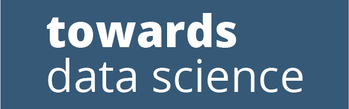

```{r, echo=FALSE, message=FALSE, warning=FALSE}
# echo=FALSE will stop the code chunk from appearing in the knit document
# warning=FALSE and message=FALSE will stop R messages from appearing in the knit document
library(tidyverse)
```


```{r, echo=FALSE, message=FALSE, warning=FALSE}
#download.file(url = "https://upload.wikimedia.org/wikipedia/commons/thumb/1/1b/R_logo.svg/1280px-R_logo.svg.png",
#              destfile = "images/R.png", mode = 'wb')
#download.file(url = "https://upload.wikimedia.org/wikipedia/commons/thumb/c/c3/Python-logo-notext.svg/1200px-Python-logo-notext.svg.png",
#              destfile = "images/python.png", mode = 'wb')
#download.file(url = "https://upload.wikimedia.org/wikipedia/commons/8/87/Sql_data_base_with_logo.png",
#              destfile = "images/sql.png", mode = 'wb')
#download.file(url = "https://upload.wikimedia.org/wikipedia/commons/thumb/1/10/SAS_logo_horiz.svg/2560px-SAS_logo_horiz.svg.png",
#              destfile = "images/sas.png", mode = 'wb')
#download.file(url = "http://students.washington.edu/ayandm/tutfiles/spsstrans.png",
#              destfile = "images/ssps.png", mode = 'wb')
#download.file(url = "https://upload.wikimedia.org/wikipedia/commons/7/79/Stata_logo_med_blue.png",
#              destfile = "images/stata.png", mode = 'wb')
#download.file(url = "https://opendreamkit.org/public/images/jupyterhub.png",
#              destfile = "images/jupyterhub.png", mode = 'wb')
#download.file(url = "https://upload.wikimedia.org/wikipedia/commons/thumb/7/73/Microsoft_Excel_2013-2019_logo.svg/2086px-Microsoft_Excel_2013-2019_logo.svg.png",
#              destfile = "images/excel.png", mode = 'wb')
#download.file(url = "https://colab.research.google.com/img/colab_favicon_256px.png",
#              destfile = "images/colab.png", mode = 'wb')
#download.file(url = "https://www.minitab.com/content/dam/www/en/uploadedImages/Content/Home/Minitab18_icon_498x50.png",
#              destfile = "images/minitab.png", mode = 'wb')
#download.file(url = "https://www.rstudio.com/wp-content/uploads/2018/10/RStudio-Logo-Flat.png",
#              destfile = "images/Rstudio.png", mode = 'wb')
#download.file(url = "https://logos-world.net/wp-content/uploads/2020/11/GitHub-Emblem.png",
#              destfile = "images/github.png", mode = 'wb')
```

## Statistical Reasoning and Data Science (DS)

\Large 

### Modern Stats+DS is

\vspace{.5cm}
1. $\text{\underline{software, programming, and computational tools implementing}}$

\vspace{.5cm}
2. mathematical and algorithmic data analysis methodologies

\vspace{.5cm}
3. explained and advocated with written and verbal communication

\vspace{.5cm}
4. to facilitate data-driven and evidence-based decision making 

\vspace{.5cm}


## 1. software, programming, and computational tools

\Large 

\begin{block}{Modern Stats+DS is based on using computational tools}
\begin{itemize}
\item Programming IS required for DS and modern applied stats
\item It's not an STA130 prerequisite but wanting to learn to code is
\end{itemize}
\end{block}

<!-- https://stackoverflow.com/questions/15625990/how-to-set-size-for-local-image-using-knitr-for-markdown -->
|{width=60px}&nbsp;&nbsp;{width=40px}|{width=100px}|{width=100px}|{width=100px}&nbsp;&nbsp;{width=50px}|
|:-:|:-:|:-:|:-:|
|{width=100px}|{width=100px}|{width=100px}|{width=30px}&nbsp;&nbsp;{width=30px}&nbsp;&nbsp;{width=90px}|

\vspace{-.35cm}
\textcolor{gray}{What does the class recognize here?}

```{r, echo=FALSE, message=FALSE, warning=FALSE}
#download.file(url = "https://stackoverflow.design/assets/img/logos/so/logo-stackoverflow.png",
#              destfile = "images/overflow.png", mode = 'wb')
#download.file(url = "https://upload.wikimedia.org/wikipedia/commons/thumb/7/75/Stack_Exchange_logo_and_wordmark.svg/1280px-Stack_Exchange_logo_and_wordmark.svg.png",
#              destfile = "images/exchange.png", mode = 'wb')
#download.file(url = "https://upload.wikimedia.org/wikipedia/commons/thumb/2/2f/Google_2015_logo.svg/368px-Google_2015_logo.svg.png",
#              destfile = "images/google.png", mode = 'wb')
#download.file(url = "https://miro.medium.com/max/8978/1*s986xIGqhfsN8U--09_AdA.png",
#              destfile = "images/medium.png", mode = 'wb')
#download.file(url = "https://www.dremio.com/wp-content/uploads/2021/10/towards-data-science-logo.png",
#              destfile = "images/tds.png", mode = 'wb')
#download.file(url = "https://logos-world.net/wp-content/uploads/2020/09/Wikipedia-Emblem.png",
#              destfile = "images/wiki.png", mode = 'wb')
```


## Pirates versus Snakes

\Huge
||||
|-|-|-|
|{width=150px}| VS |{width=125px}|

\normalsize
\begin{block}{Modern Stats+DS learning communities propegate knowledge and solutions}
\begin{itemize}
\item R is ubiquitous in traditional academic data analysis and statistical communities
\begin{itemize}
\item and increasingly supports machine learning (ML), bioinformatics, etc.
\end{itemize}
\item Python is dominant in nearly all application involving coding, such as DS and ML
\begin{itemize}
\item and increasingly overlaps and supports users traditionally from the R community
\end{itemize}
\end{itemize}
\end{block}


## Class Check Round 1

\Huge [https://pollev.com/sta](https://pollev.com/sta) (2 questions)


## UofT DoSS Community

\Huge Community / Mentorship Program!


## Statistical Reasoning and Data Science (DS)

\Large 

### Modern Stats+DS is

\vspace{.5cm}
1. software, programming, and computational tools implementing

\vspace{.5cm}
2. $\text{\underline{mathematical and algorithmic data analysis methodologies}}$

\vspace{.5cm}
3. explained and advocated with written and verbal communication

\vspace{.5cm}
4. to facilitate data-driven and evidence-based decision making 


## 2. math, algorithms, and data analysis Part I: Structured Learning

\large

The course (on average across students) should take **10 hours a week**

| Section     | ET       | Monday     | Thursday       | Friday     |
|-------------|----------|------------|----------------|------------|
|  L0101      | 9:10 AM  | 2hr Lec    |                | 2hr Tut    |
|  L0201      | 2:10 PM  | 2hr Lec    |                | 2hr Tut    | 
| L0101+L0201 | 5:00 PM  |            | R 2hr HW Due |            |
| L0101+L0201 | 10:00 PM |            |                | +1hr Tut work Due |

\vspace{-.5cm}
with 7 hours allocated as indicated above and 3 hours left available for study and review, office hours and piazza discussion boards, and eventual team project work.

###

Boost your skills with free textbook resources like [R for Data Science](https://r4ds.had.co.nz/) by Wickham and Grolemund, free learning tools like the [DoSS Toolkit](https://dosstoolkit.com/) from STA130 profs Alexander and Caetano et al., and free online [primers](https://rstudio.cloud/learn/primers/), [cheatsheets](https://www.rstudio.com/resources/cheatsheets/), and [courses](https://www.datacamp.com/courses/free-introduction-to-r)

## Class Check Round 2

\Huge [https://pollev.com/sta](https://pollev.com/sta) (3 questions)

## 2. math, algorithms, and data analysis Part II: Unstructured Learning

\Large 

\begin{block}{When first learning, structured course material is good}
Eventually it's faster to learn and troubleshoot problems yourself
\end{block}

|{width=175px}|{width=125px}|{width=125px}|
|:-:|:-:|:-:|
|{width=175px}|{width=125px}|{width=125px}|


## 2. math, algorithms, and data analysis Part II: Structured Learning $\rightarrow$ Unstructured Learning

\large

### The Troubleshooting / Coding Resilience workflow

\vspace{.15cm}
1. Have I reviewed the [course notes](https://github.com/pointOfive/STA130) well enough?
\vspace{.15cm}

2. Is this the kind of problem a [google search](https://www.google.com/search?q=let+me+google+that+for+you) could fix?
\vspace{.15cm}

3. Could this have already been answered on the [course piazza](https://piazza.com)?
\vspace{.15cm}

4. Am I SURE this hasn't already been answered on the [course piazza](https://piazza.com)?
\vspace{.15cm}

5. Would discussing my problem in an office hour be more helpful than [piazza](https://piazza.com)?
\vspace{.15cm}

6.  Would discussing my problem with a peer be more helpful than [piazza](https://piazza.com)?
\vspace{.15cm}

7. Is asking on the [course piazza](https://piazza.com) probably the fastest way to get an answer?
\vspace{.15cm}


## Class Check Round 3

\Huge [https://pollev.com/sta](https://pollev.com/sta) (3 questions)


## Statistical Reasoning and Data Science (DS)

\Large 

### Modern Stats+DS is

\vspace{.5cm}
1. software, programming, and computational tools implementing

\vspace{.5cm}
2. mathematical and algorithmic data analysis methodologies

\vspace{.5cm}
3. $\text{\underline{explained and advocated w/ written and verbal communication}}$

\vspace{.5cm}
4. to facilitate data-driven and evidence-based decision making 


## 3. written and verbal communication: course focus

\large


| 2hr Lec | Monday 9:10AM ET and 2:10PM ET | N/A |
|-:|:-|-:|
| Study/Review | [Slides](https://github.com/pointOfive/STA130), [Demos](https://github.com/pointOfive/STA130), [Practice Quizzes](https://q.utoronto.ca/courses/277998/quizzes) | N/A |
| Exams | Midterm 20% and Final 34% | **54%** |
| 2hr [R HW](https://github.com/pointOfive/STA130) | Due Thursday 5pm | **7%** |
| 3hr Tut HW | Friday 9:10PM ET and  2:10PM ET | **14%** | 
| [Engagement](https://utoronto.sharepoint.com/sites/ArtSci-STA/Mentorship/SitePages/STA130-Mentorship-Program-Home.aspx) | STA130 Mentorship Program | **5%** |
| [Coures Project](https://github.com/pointOfive/STA130) |  Concepts, Communication, Coding | **20%** |

\vspace{-.35cm}

\textcolor{red}{*At least 3 hours per week for Study/Review and Project work}

###

Boost your skills with free textbook resources like [R for Data Science](https://r4ds.had.co.nz/) by Wickham and Grolemund, free learning tools like the [DoSS Toolkit](https://dosstoolkit.com/) from STA130 profs Alexander and Caetano et al., and free online [primers](https://rstudio.cloud/learn/primers/), [cheatsheets](https://www.rstudio.com/resources/cheatsheets/), and [courses](https://www.datacamp.com/courses/free-introduction-to-r)


## 3. written and verbal communication: course rules


\large

| 2hr Lec | not mandatory, but also not recorded | N/A |
|-:|:-|-:|
| Study/Review | not mandatory, but good exam practice | N/A |
| Exams | Midterm Reweight + [FAS Defer Petition](https://www.artsci.utoronto.ca/current/faculty-registrar/petitions/deferred-exams) | 54% |
| [Coures Project](https://github.com/pointOfive/STA130) | Missed Dec 8th Presentations Reschedule | 20% |
| 3hr Tut HW | Best 7/9 Policy + [College Registrar](https://www.artsci.utoronto.ca/current/academic-advising-and-support/college-registrars-offices)  | 14% | 
| 2hr [R HW](https://github.com/pointOfive/STA130) | Best 7/10 Policy + [College Registrar](https://www.artsci.utoronto.ca/current/academic-advising-and-support/college-registrars-offices) | 7% |
| [Participation](https://github.com/pointOfive/STA130) | Due Dec 8th: No Exceptions | 5% |

\vspace{-.25cm}

###

For more details on any of these policies please review the [syllabus](https://q.utoronto.ca/courses/277998/assignments/syllabus).
*E.g., "7/X policy" extensions must be requested within one week of return to UofT, and there are similar time-sensitive requirements for mixed exams and project presentations.*


## Class Check Round 4

\Huge [https://pollev.com/sta](https://pollev.com/sta) (4 questions)


## Statistical Reasoning and Data Science (DS)

\Large 

### Modern Stats+DS is

\vspace{.5cm}
1. software, programming, and computational tools implementing

\vspace{.5cm}
2. mathematical and algorithmic data analysis methodologies

\vspace{.5cm}
3. explained and advocated with written and verbal communication

\vspace{.5cm}
4. $\text{\underline{to facilitate data-driven and evidence-based decision making}}$ 


## 4. facilitating data-driven evidence-based work: Jupyterhub

[Jupyterhub](jupyter.utoronto.ca/) is a cloud-based service allowing you to run R/Rstudio from any web browser

- You can run R/Rstudio locally as well, and you may need to install Rstudio so you can do this for this class in case of temporary Jupyterhub service outage 

\vspace{.5cm}

<!-- https://stackoverflow.com/questions/15142134/slides-with-columns-in-pandoc -->
::: columns
:::: column

\Large

\vspace{.75cm}

From [Jupyerhub in a gif-y](https://rstudio-with-jupyerhub-uoft.netlify.app/#1)
                              
\vspace{.25cm}
                            
<!-- https://stackoverflow.com/questions/52275963/insert-gif-in-pdf-using-rmarkdown -->
 ```{r, echo=FALSE, message=FALSE, warning=FALSE}
if (knitr:::is_latex_output()) {knitr::asis_output('\\href{https://rstudio-with-jupyerhub-uoft.netlify.app/img/logingin.gif}{Logging in}')
}else{knitr::include_graphics("https://rstudio-with-jupyerhub-uoft.netlify.app/img/logingin.gif")}
```
```{r, echo=FALSE, message=FALSE, warning=FALSE}
if (knitr:::is_latex_output()) {knitr::asis_output('\\href{https://rstudio-with-jupyerhub-uoft.netlify.app/img/troubleshooting.gif}{reconnecting}')
}else{knitr::include_graphics("https://rstudio-with-jupyerhub-uoft.netlify.app/img/troubleshooting.gif")}
```

::::
:::: column

```{r, echo=FALSE, message=FALSE, warning=FALSE}
#download.file(url = "https://raw.githubusercontent.com/utoronto-2i2c/homepage/master/extra-assets/images/home-hero.png",
#              destfile = "images/UofTjupyterhub.png", mode = 'wb')
```

{width=200px}
::::
:::


## 4. facilitating data-driven evidence-based work: Rstudio
                              
[Rstudio](https://www.rstudio.com/) is just a nice GUI IDE program that wraps up [R](https://www.r-project.org/) along with a .Rmd code editor and file and data management capabilities

  - GUI means "graphical user interface" while IDE means "integrated developers environment", and .Rmd [RMarkdown](https://bookdown.org/yihui/rmarkdown/) files ([based](https://stackoverflow.com/questions/40563479/relationship-between-r-markdown-knitr-pandoc-and-bookdown) on [Markdown markup language](https://www.markdownguide.org/getting-started/)) combine text with R code to create .html and .pdf output files and [presentation slides](https://bookdown.org/yihui/rmarkdown/beamer-presentation.html) ([like the ones I'm using here now](https://deic.uab.cat/~iblanes/beamer_gallery/)).  


<!-- https://stackoverflow.com/questions/24677642/centering-image-and-text-in-r-markdown-for-a-pdf-report -->

\begin{center}
\includegraphics[width=0.5\textwidth]{images/rstudio.png}
\end{center}

## 4. facilitating data-driven evidence-based work: Knitting


<!-- https://stackoverflow.com/questions/28000062/tables-and-figures-side-by-side-in-knitr-or-rmarkdown-beamer -->

\hspace*{-.75cm}
\begin{minipage}[t]{0.825\linewidth}
\vspace*{-1cm}

```{r echo=FALSE, message=FALSE, warning=FALSE, out.width="100%", fig.align='left', fig.alg='Two fuzzy round monsters dressed as wizards, working together to brew different things together from a pantry (code, text, figures, etc.) in a cauldron labeled “R Markdown”. The monster wizard at the cauldron is reading a recipe that includes steps “1. Add text. 2. Add code. 3. Knit. 4. (magic) 5. Celebrate perceived wizardry.” The R Markdown potion then travels through a tube, and is converted to markdown by a monster on a broom with a magic wand, and eventually converted to an output by pandoc. Stylized text (in a font similar to Harry Potter) reads “R Markdown. Text. Code. Output. Get it together, people.”'}
#download.file(url = "https://github.com/allisonhorst/stats-illustrations/raw/master/rstats-artwork/rmarkdown_rockstar.png",
#          destfile = "images/rmarkdown_rockstar.png", mode = 'wb')
#download.file(url = "https://github.com/allisonhorst/stats-illustrations/raw/master/rstats-artwork/rmarkdown_wizards.png",
#          destfile = "images/rmarkdown_wizards.png", mode = 'wb')
#download.file(url = "https://github.com/allisonhorst/stats-illustrations/raw/master/rstats-artwork/reproducibility_court.png",
#          destfile = "images/reproducibility_court.png", mode = 'wb')
#download.file(url = "https://github.com/allisonhorst/stats-illustrations/raw/master/rstats-artwork/r_first_then.png",
#          destfile = "images/r_first_then.png", mode = 'wb')
knitr::include_graphics("images/rmarkdown_wizards.png")
```

\vspace*{-.5cm}
\hspace*{1cm} Rstudio knitting as illustrated by @\href{https://twitter.com/allison_horst}{allison\_horst}

\end{minipage}\hfill
\begin{minipage}[t]{0.175\linewidth}

\vspace{-.6cm}
```{r, echo=FALSE, message=FALSE, warning=FALSE}
if (knitr:::is_latex_output()) {
  knitr::asis_output('\\begin{center}\\Huge \\href{https://rstudio-with-jupyerhub-uoft.netlify.app/img/knitting.gif}{Knitting}\\end{center}')
} else {
  knitr::include_graphics("https://rstudio-with-jupyerhub-uoft.netlify.app/img/knitting.gif")
}
```
\vspace{-1.0cm}
```{r, echo=FALSE, message=FALSE, warning=FALSE}
if (knitr:::is_latex_output()) {
  knitr::asis_output('\\begin{center}\\Huge \\href{https://rstudio-with-jupyerhub-uoft.netlify.app/img/knitting.gif}{Knitting}\\end{center}')
} else {
  knitr::include_graphics("https://rstudio-with-jupyerhub-uoft.netlify.app/img/knitting.gif")
}
```
\vspace{-1.0cm}
```{r, echo=FALSE, message=FALSE, warning=FALSE}
if (knitr:::is_latex_output()) {
  knitr::asis_output('\\begin{center}\\Huge \\href{https://rstudio-with-jupyerhub-uoft.netlify.app/img/knitting.gif}{Knitting}\\end{center}')
} else {
  knitr::include_graphics("https://rstudio-with-jupyerhub-uoft.netlify.app/img/knitting.gif")
}
```
\vspace{-1.0cm}
```{r, echo=FALSE, message=FALSE, warning=FALSE}
if (knitr:::is_latex_output()) {
  knitr::asis_output('\\begin{center}\\Huge \\href{https://rstudio-with-jupyerhub-uoft.netlify.app/img/knitting.gif}{Knitting}\\end{center}')
} else {
  knitr::include_graphics("https://rstudio-with-jupyerhub-uoft.netlify.app/img/knitting.gif")
}
```
\vspace{-1.0cm}
```{r, echo=FALSE, message=FALSE, warning=FALSE}
if (knitr:::is_latex_output()) {
  knitr::asis_output('\\begin{center}\\Huge \\href{https://rstudio-with-jupyerhub-uoft.netlify.app/img/knitting.gif}{Knitting}\\end{center}')
} else {
  knitr::include_graphics("https://rstudio-with-jupyerhub-uoft.netlify.app/img/knitting.gif")
}
```
\vspace{-1.0cm}
```{r, echo=FALSE, message=FALSE, warning=FALSE}
if (knitr:::is_latex_output()) {
  knitr::asis_output('\\begin{center}\\Huge \\href{https://rstudio-with-jupyerhub-uoft.netlify.app/img/knitting.gif}{Knitting}\\end{center}')
} else {
  knitr::include_graphics("https://rstudio-with-jupyerhub-uoft.netlify.app/img/knitting.gif")
}
```

\end{minipage}


## 4. facilitating data-driven evidence-based work: Rstudio + Code Chunks

```{r, echo=FALSE, message=FALSE, warning=FALSE}
#download.file(url = "https://datacarpentry.org/genomics-r-intro/fig/rstudio_session_4pane_layout.png",
#              destfile = "images/Rstudio_panes.png", mode = 'wb')
```

:::columns
::::column

\vspace{0.5cm}

1. ***Source*** [Top Left pane]: 

    Rmarkdown code+text files 
\vspace{0.1cm}

2. ***Console*** [Bottom Left pane]: 

   Code+Knitting history
\vspace{0.1cm}

3. ***Environment*** [Top Right pane]: 

   Variables and data sets
\vspace{0.1cm}

4. ***Files*** [Bottom Right pane]: 

   Figure and knitting outputs 

::::
::::column


::::
:::

### To run code-chunks use `ctrl-shift-enter` (PC) or `cmd-shift-return` (Mac)

- This is just one of many keyboard (key-binding) [shortcuts](https://support.rstudio.com/hc/en-us/articles/200711853-Keyboard-Shortcuts) in Rstudio


## 4. facilitating data-driven evidence-based work: Reproducibility

```{r echo=FALSE, message=FALSE, warning=FALSE, out.width="85%", fig.align='center', fig.center='A judge’s desk labeled “Reproducibility” with a witness stand right next to it. On the witness stand is a smiling and confident R Markdown document pointing at some lines of code on itself. A fuzzy monster lawyer in a polka-dot tie stands proudly saying “Nothing further!” The judge (also a cute fuzzy monster) is smiling with their hands raised in celebration of reproducible work.'}
knitr::include_graphics("images/reproducibility_court.png")
```
\vspace{-1.5cm}
Rmd reproducibility as illustrated by @\href{https://twitter.com/allison_horst}{allison\_horst}

## 4. facilitating data-driven evidence-based work: File Management

From [Jupyerhub in a gif-y](https://rstudio-with-jupyerhub-uoft.netlify.app/#1)

```{r, echo=FALSE, message=FALSE, warning=FALSE}
if (knitr:::is_latex_output()) {
  knitr::asis_output('\\href{https://rstudio-with-jupyerhub-uoft.netlify.app/img/files.gif}{folders}')
} else {
  knitr::include_graphics("https://rstudio-with-jupyerhub-uoft.netlify.app/img/files.gif")
}
```
```{r, echo=FALSE, message=FALSE, warning=FALSE}
if (knitr:::is_latex_output()) {
  knitr::asis_output('\\href{https://rstudio-with-jupyerhub-uoft.netlify.app/img/moving.gif}{relocations}')
} else {
  knitr::include_graphics("https://rstudio-with-jupyerhub-uoft.netlify.app/img/moving.gif")
}
```
```{r, echo=FALSE, message=FALSE, warning=FALSE}
if (knitr:::is_latex_output()) {
  knitr::asis_output('\\href{https://rstudio-with-jupyerhub-uoft.netlify.app/img/upload.gif}{uploading}')
} else {
  knitr::include_graphics("https://rstudio-with-jupyerhub-uoft.netlify.app/img/upload.gif")
}
```
```{r, echo=FALSE, message=FALSE, warning=FALSE}
if (knitr:::is_latex_output()) {
  knitr::asis_output('\\href{https://rstudio-with-jupyerhub-uoft.netlify.app/img/sharinglink.gif}{linking}')
} else {
  knitr::include_graphics("https://rstudio-with-jupyerhub-uoft.netlify.app/img/sharinglink.gif")
}
```
```{r, echo=FALSE, message=FALSE, warning=FALSE}
if (knitr:::is_latex_output()) {
  knitr::asis_output('\\href{https://rstudio-with-jupyerhub-uoft.netlify.app/img/project.gif}{projects}')
} else {
  knitr::include_graphics("https://rstudio-with-jupyerhub-uoft.netlify.app/img/project.gif")
}
```
```{r, echo=FALSE, message=FALSE, warning=FALSE}
if (knitr:::is_latex_output()) {
  knitr::asis_output('\\href{https://rstudio-with-jupyerhub-uoft.netlify.app/img/openfile.gif}{files}')
} else {
  knitr::include_graphics("https://rstudio-with-jupyerhub-uoft.netlify.app/img/openfile.gif")
}
```
```{r, echo=FALSE, message=FALSE, warning=FALSE}
if (knitr:::is_latex_output()) {
  knitr::asis_output('\\href{https://rstudio-with-jupyerhub-uoft.netlify.app/img/exporting.gif}{exporting}')
} else {
  knitr::include_graphics("https://rstudio-with-jupyerhub-uoft.netlify.app/img/exporting.gif")
}
```

```{r echo=FALSE}
#download.file(url = "https://preview.redd.it/1m9l0op71go21.png?auto=webp&s=dda3e539baa704447fb6c132b339464b9b454236",
#          destfile = "images/organize.png", mode = 'wb')
#download.file(url = "https://i.pinimg.com/236x/87/30/b3/8730b35f6f086d92411a4be61d6d2fd3.jpg",
#          destfile = "images/organize2.jpg", mode = 'wb')
```
{width=300px}&nbsp;&nbsp;&nbsp;&nbsp;&nbsp;&nbsp;&nbsp;&nbsp;&nbsp;&nbsp;{width=185px}


## 4. facilitating data-driven evidence-based work: R

\begin{minipage}[t]{0.48\linewidth}

\vspace{1cm}

\href{https://www.r-project.org/about.html}{R} is a data analysis programming console to support the work of statisticians, data scientists, and other data-centric professions
\vspace{.05cm}

\begin{itemize}
\item R is a programming language, but its methods and algorithms are usually built-in or loaded from packages, so most R users don't build algorithms or data types like in C++ or java
\end{itemize}

\end{minipage}\hfill
\begin{minipage}[t]{0.48\linewidth}
\begin{figure}[h!]
\includegraphics[width=0.8\textwidth]{images/r_first_then.png}
\caption*{R as Illustrated by @\href{https://twitter.com/allison_horst}{allison\_horst}}
\end{figure}
\end{minipage}

## 4. facilitating data-driven evidence-based work: R Packages

```{r echo=FALSE}
#download.file(url = "https://tidyverse.tidyverse.org/logo.png",
#             destfile = "images/tidyverse.png", mode = 'wb')
#download.file(url = "https://elixir-luxembourg.org/assets/events_photos/2021_05_06_R_Tidyverse.png",
#             destfile = "images/tidyverse2.jpg", mode = 'wb')
```
\begin{minipage}[t]{0.31\linewidth}

\vspace{0.5cm}

Newly developed statistical methods are often made available as R package

\vspace{0.25cm}

This makes the publication manuscripts stronger and increases a methods use

\vspace{0.25cm}

Comprehensive R Archive Network (\href{https://cran.r-project.org/}{CRAN})
currently has \href{https://cran.r-project.org/web/packages/}{18611} packages

\vspace{0.5cm}

\end{minipage}\hfill
\begin{minipage}[t]{0.31\linewidth}


For those new to R and arriving with interest in DS, the tidyverse
is the key set of packages

\vspace{0.5cm}

\begin{center}
\includegraphics[width=1.50\textwidth]{images/tidyverse.png}
\end{center}
\end{minipage}\hfill
\begin{minipage}[t]{0.31\linewidth}

\vspace{0.5cm}

The tidyverse includes
R packages that help facilitate modern stats+DS

\vspace{0.5cm}

\includegraphics[width=.99\textwidth]{images/tidyverse2.jpg}
\end{minipage}


## 4. facilitating data-driven evidence-based work: Common Errors with Packages and Libraries

\Large Installing Packages, Loading Libraries, and Common Errors
\normalsize 
\vspace{.25cm}

### Installing Packages, Loading Libraries, and Common Errors

\vspace{.25cm}

- You can't run R code unless its package is loaded as `library(packagename)`

\vspace{.25cm}

- You can't load packages unless `install.packages("packagename")` is run first
- Packages installed on Jupyterhub must be re-install for each new session...

\vspace{.25cm}

- Some pre-installed packages, e.g., `library(tidyverse)`, will always load
- \textcolor{red}{\texttt{There is no package called}} errors mean `install.packages()` is needed

\vspace{.25cm}

- \textcolor{blue}{But you can't "knit" .Rmd files \texttt{install.packages("packagename")} code}
  - \textcolor{blue}{So you have to frequently comment and uncomment \texttt{install.packages()}}


## Class Check Round 5

\Huge [https://pollev.com/sta](https://pollev.com/sta) (5 questions)

\vspace{1cm}

\normalsize
### And some Self Quiz questions you should be asking yourself...

Can you log into JupyterHub and open and knit an RMarkdown document in RStudio?

Can you navigate the Code, R Console, and Files panes in the RStudio interface? 

Did you see the Environment pane and the Help, Packages, and Tutorial tabs?


## Statistical Reasoning and Data Science (DS)

\Large 

### Modern Stats+DS is

\vspace{.5cm}
1. software, programming, and computational tools implementing

\vspace{.5cm}
2. mathematical and algorithmic data analysis methodologies

\vspace{.5cm}
3. explained and advocated with written and verbal communication

\vspace{.5cm}
4. to facilitate data-driven and evidence-based decision making 

\vspace{.5cm}


## Statistical Reasoning and Data Science (DS) $\quad\quad\quad$Course Learning Objectives

\large
1. Implement the computational steps involved in the management and statistical analysis of data using R.

2. Carry out a variety of statistical analyses in R and interpret the results of the analyses.

3. Clearly communicate the results of statistical analyses to technical and non-technical audiences.

4. Identify appropriate uses of statistical methods to answer questions, including their strengths and weaknesses.

5. Describe how statistical methods can be used to learn from data, including methods for description, explanation, and prediction.

---

<!-- https://stackoverflow.com/questions/51287734/rmarkdown-package-pdftex-def-error-online-image-not-found --> 
<!-- https://stackoverflow.com/questions/25415365/insert-side-by-side-png-images-using-knitr -->
```{r echo=FALSE, message=FALSE, warning=FALSE, out.width="100%", fig.align='center', fig.alt='A glam rock band comprised of 3 fuzzy round monsters labeled as “Text”, “Outputs” and “Code” performing together. Stylized title text reads: “R Markdown - we’re getting the band back together.”'}
knitr::include_graphics("images/rmarkdown_rockstar.png")
```

## Rstudio Demo

1. Click this [jupyterhub repo launcher link](https://jupyter.utoronto.ca/hub/user-redirect/git-pull?repo=https%3A%2F%2Fgithub.com%2FpointOfive%2FSTA130_Week1_Demo&urlpath=rstudio%2F&branch=main)

   - If this fails (1) log into [RStudio on Jupyterhub](jupyter.utoronto.ca/), (2) delete the folder, (3) retry
   
2. Navigate to the intended directory in the (bottom right) files pane

3. Open the intended .Rmd file

4. Follow along / complete the demo

5. Understand Rmd+pdf submission requirements 

6. Determine and commit to a file organization scheme
